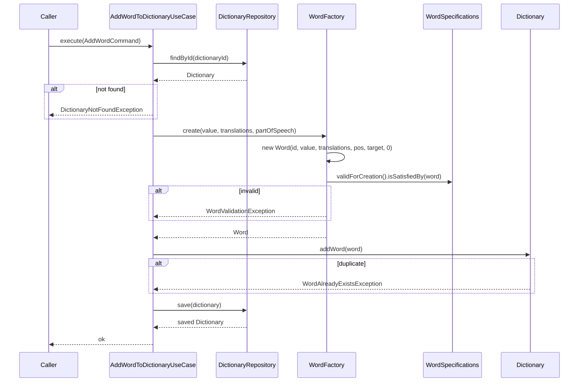

# Dictionary

Словарь принадлежит ученику. Содержит слова, собранные во время уроков.

## Составляющие

### Dictionary (AggregateRoot)
- Корень агрегата, владеет списком Word.
- Инварианты: не допускает дубликатов слов по value (case-insensitive).
- Связь со Student: Student ссылается на DictionaryId. Dictionary не знает про Student.

### Word (Entity)
- Слово с множеством переводов, частью речи и прогрессом изучения.
- Immutable поля: `id`, `value`, `translations` (Set<String>).
- Mutable поля: `partOfSpeech`, `targetRepetitions`, `currentRepetitions`.
- Статус вычисляется: `NEW` (0), `IN_PROGRESS` (>0, <target), `LEARNED` (>=target).
- Защита от удаления последнего перевода.

## Пакеты

```
dictionary/
├── api/
│   ├── AddWordCommand           # входной DTO для use case
│   ├── AddWordToDictionary      # порт (use case interface)
│   ├── DictionaryId             # ID агрегата
│   └── PartOfSpeech             # enum: NOUN, VERB, ADJECTIVE
├── application/
│   ├── config/properties/
│   │   └── WordSpecificationSpringProperties  # @ConfigurationProperties, impl WordSpecificationConfig
│   └── usecase/
│       └── AddWordToDictionaryUseCase         # implements AddWordToDictionary
├── infrastructure/
│   └── persistence/
│       └── InMemoryDictionaryRepository
├── domain/
│   ├── dictionary/
│   │   ├── Dictionary            # @AggregateRoot
│   │   ├── DictionaryRepository  # порт
│   │   └── exception/
│   │       ├── DictionaryDomainException
│   │       ├── DictionaryNotFoundException
│   │       └── WordAlreadyExistsException
│   └── word/
│       ├── Word                  # @Entity
│       ├── WordId                # record
│       ├── WordStatus            # enum: NEW, IN_PROGRESS, LEARNED
│       ├── WordFactory           # создаёт Word + валидация через спецификации
│       ├── WordSpecificationConfig  # interface: параметры валидации (доменный контракт)
│       ├── WordSpecifications    # instance class, получает config через конструктор
│       └── exception/
│           ├── WordDomainException
│           ├── WordValidationException
│           └── LastTranslationException
└── package-info.java             # @ApplicationModule
```

## Поток добавления слова



`targetRepetitions` берётся из конфига (`WordSpecificationConfig.defaultTargetRepetitions()`), не из команды.

## Обработка ошибок

Иерархия доменных исключений:
```
shared/api/DomainException (abstract)
├── WordDomainException
│   ├── LastTranslationException
│   └── WordValidationException
└── DictionaryDomainException
    ├── DictionaryNotFoundException
    └── WordAlreadyExistsException
```

`IllegalArgumentException` — только для null-аргументов (баг программиста, не доменная ошибка).

## Спецификации (валидация)

Каждое правило — отдельный метод в `WordSpecifications`. Композит `validForCreation()` включает:
- value: not blank, only english letters, min/max length
- translations: не пуст, каждый not blank, only russian letters, min/max length, мин. количество переводов
- partOfSpeech: not null
- targetRepetitions: > 0, не превышает max
- currentRepetitions: >= 0

Параметры берутся из `WordSpecificationConfig` (интерфейс в домене, реализация — `WordSpecificationSpringProperties` в application).

## Инфраструктура

```
infrastructure/persistence/
└── InMemoryDictionaryRepository    # @Repository, ConcurrentHashMap
```

Реализация DictionaryRepository в памяти. Будет заменена на JPA при добавлении persistence-слоя.

## Spring Wiring

```
DictionaryModuleConfig (@Configuration)
├── @EnableConfigurationProperties(WordSpecificationSpringProperties)
├── WordSpecifications         ← WordSpecificationConfig
├── WordFactory                ← WordSpecifications + WordSpecificationConfig
└── AddWordToDictionary        ← DictionaryRepository + WordFactory
```

## Тесты (37/37)
- WordTest (11) — статус, переводы, часть речи
- WordSpecificationsTest (10) — все правила + edge cases
- WordFactoryTest (5) — создание, дефолты, rejects
- DictionaryTest (3) — addWord, дубликат, null
- AddWordToDictionaryUseCaseTest (3) — success, not found, duplicate
- DictionaryModuleConfigTest (5) — wiring, properties, factory, use case full flow
