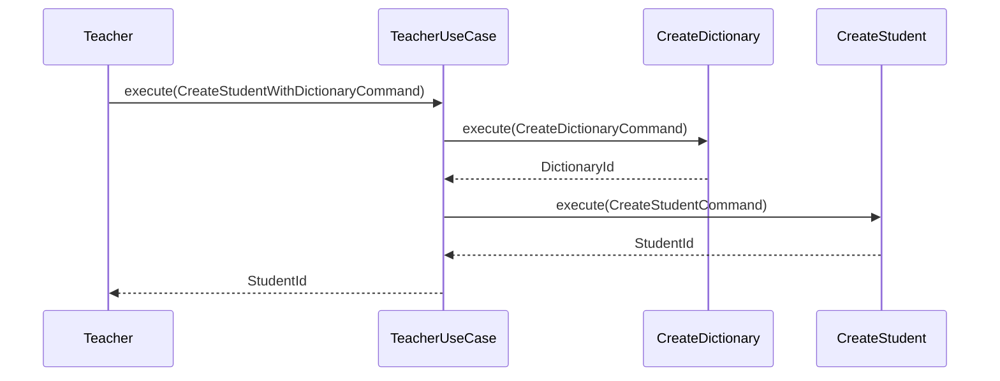

# Teacher

Учитель. Управляет учениками, ведёт уроки.

## Составляющие

### Teacher (Entity)
- `id` — скелет, будет дополнен при интеграции с Telegram.

## Use Cases

| Use Case | Статус |
|----------|--------|
| `CreateStudentWithDictionary` | ✅ |

### CreateStudentWithDictionary
Оркестрирует создание ученика вместе со словарём.



## Зависимости (Spring Modulith)
```java
@ApplicationModule(allowedDependencies = {"dictionary", "student"})
```

## Тесты (3/3)
- TeacherTest (1), CreateStudentWithDictionaryUseCaseTest (2)
