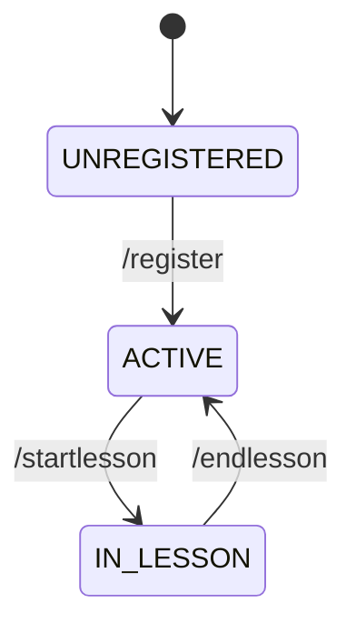

# TG Bot State Machine

## Состояния

| State | Описание |
|-------|----------|
| `UNREGISTERED` | Пользователь открыл бота, но не зарегистрировался |
| `ACTIVE` | Зарегистрирован, может управлять учениками и уроками |
| `IN_LESSON` | Находится в активном уроке, может добавлять слова |

## Команды

### UNREGISTERED
| Команда | Переход | Новое состояние |
|---------|---------|-----------------|
| `/register <name>` | ✅ | `ACTIVE` |
| `/help` | ❌ | — |
| `/start` | ❌ | — |

### ACTIVE
| Команда | Переход | Новое состояние |
|---------|---------|-----------------|
| `/newstudent <name>` | ❌ | — |
| `/startlesson <name>` | ✅ | `IN_LESSON` |
| `/mystudents` | ❌ | — |
| `/help` | ❌ | — |

### IN_LESSON
| Команда | Переход | Новое состояние |
|---------|---------|-----------------|
| `/add <word> <POS> <tr>` | ❌ | — |
| `/endlesson` | ✅ | `ACTIVE` |
| `/help` | ❌ | — |

## Граф переходов

