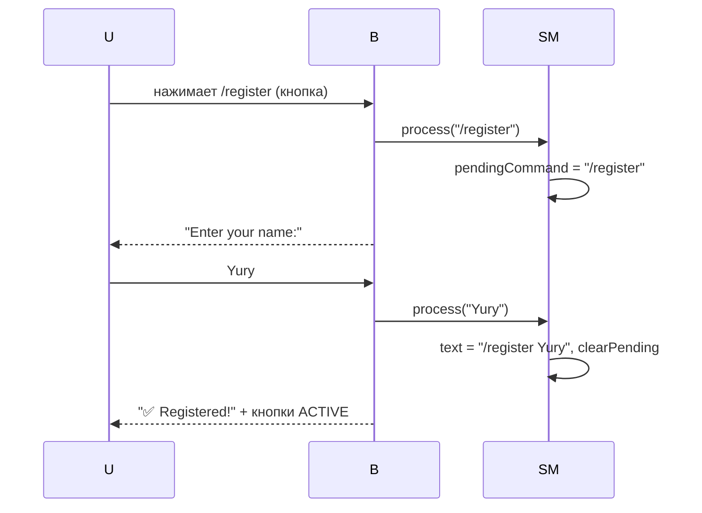
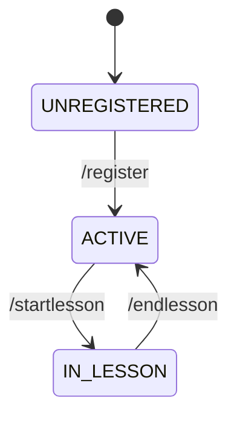
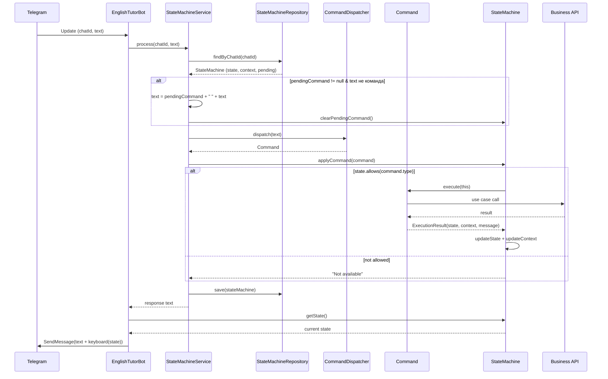
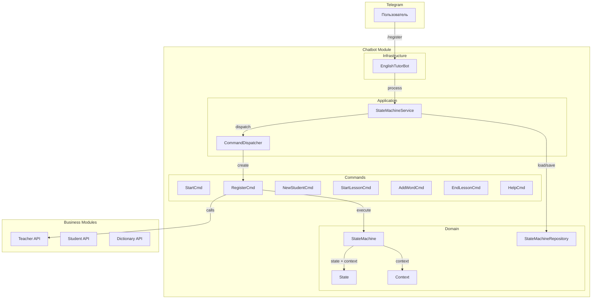

# Telegram Bot State Machine

## Состояния

```
UNREGISTERED → ACTIVE → IN_LESSON → ACTIVE → ...
```

| State | Контекст | Допустимые команды |
|-------|----------|-------------------|
| `UNREGISTERED` | — | `/start`, `/register`, `/help` |
| `ACTIVE` | `ActiveContext(teacherId)` | `/newstudent`, `/startlesson`, `/help` |
| `IN_LESSON` | `LessonContext(teacherId, studentId, lessonId)` | `/add`, `/endlesson`, `/help` |

## Двухфазный ввод

Команды с аргументами (`/register`, `/newstudent`, `/startlesson`, `/add`) работают в два шага:



1. **Кнопка** — бот сохраняет `pendingCommand` и просит ввод
2. **Текст** — бот подставляет `pendingCommand + " " + текст` и выполняет

## Граф переходов



## Полный цикл обработки сообщения



## Архитектура взаимодействия


